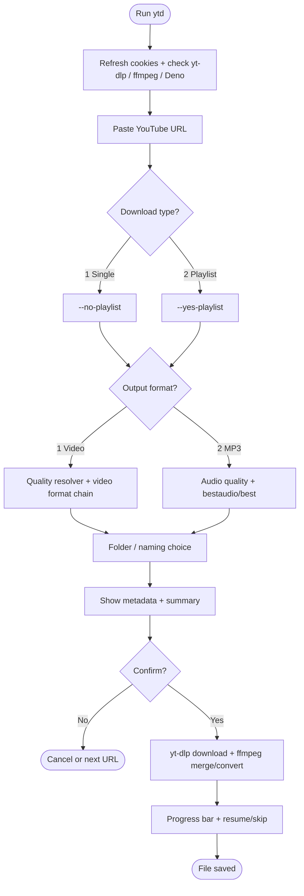
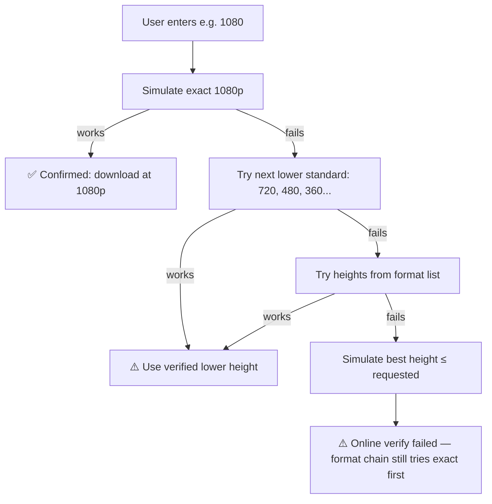
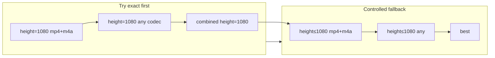
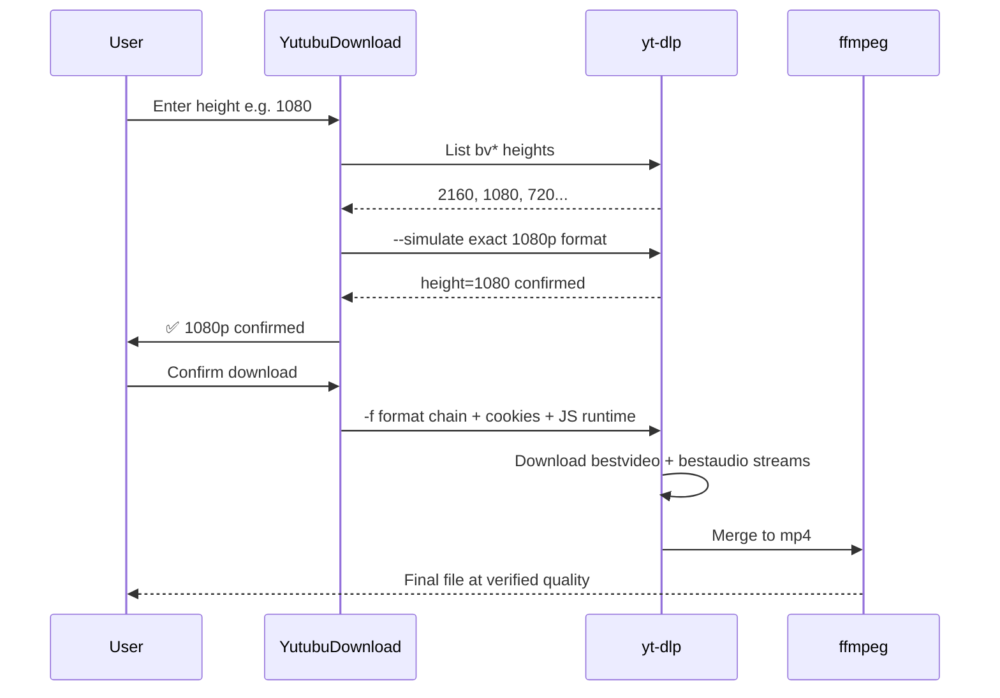
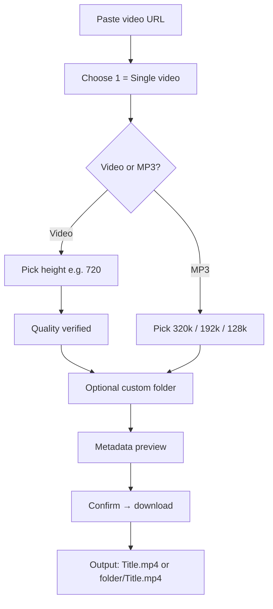
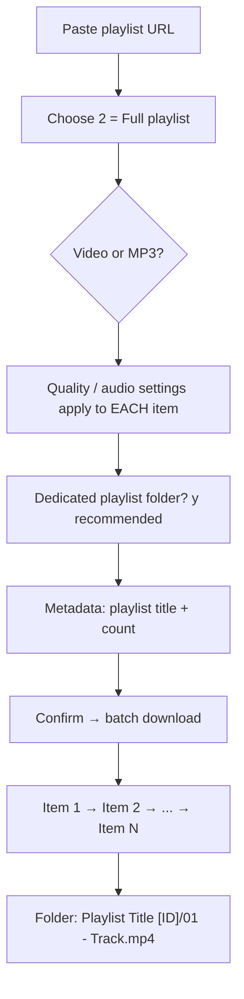
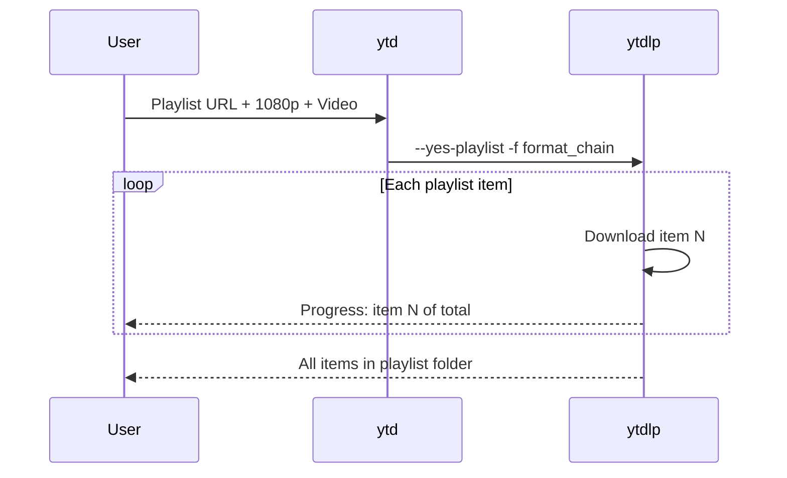
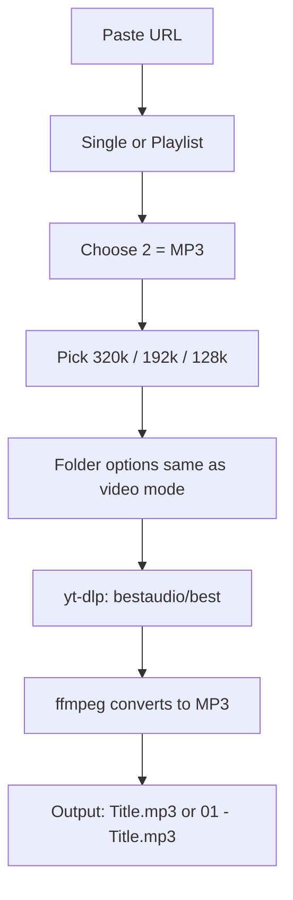
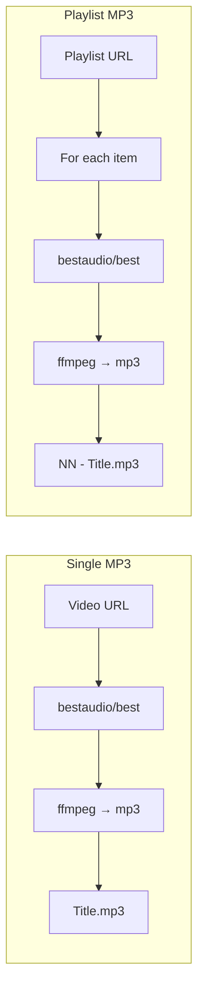
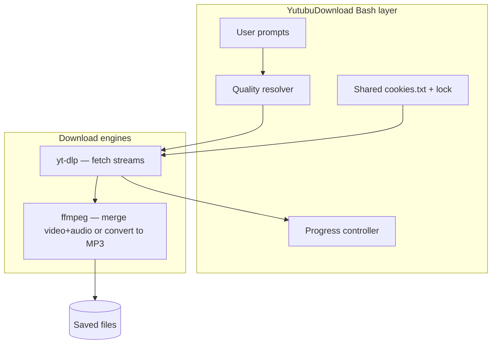

# Download Guide — Quality, Video, Playlist & Audio

This guide explains **how YutubuDownload (`ytd`) keeps video quality reliable** and **how each download mode works** — single video, full playlist, and MP3 audio — in plain language with diagrams.

---

## The Big Picture

Every download follows the same orchestration layer. What changes is the branch you pick at prompts: single vs playlist, video vs MP3.



---

## How Video Quality Is Maintained

Video quality is protected in **three phases**: before download (verification), during download (format chain), and in the UI (honest reporting). The script never silently downgrades just because a quick format list was incomplete.

### Phase 1 — Discover what exists

When you choose **Video**, `ytd` asks yt-dlp which heights are available:

1. List **video-only** streams (`bv*`) — these define real resolution options.
2. If that fails, retry **without cookies** (stale cookie files can block listing).
3. If still empty, check **combined** streams (`b`) as a fallback hint.

Supported standard heights: **360, 480, 720, 1080, 1440, 2160** (4K).


### Phase 2 — Verify your typed height (before download)

You type a max height (e.g. `1080`). The script does **not** immediately assume it is unavailable. It runs `yt-dlp --simulate` to confirm what would actually be fetched:

| Step | What happens |
|------|----------------|
| 1 | Probe **exact** height you requested (`height=1080`) |
| 2 | If that fails, walk **down standard heights** (720, 480, …) |
| 3 | If still unresolved, use listed heights as hints |
| 4 | Last resort: probe `height<=requested` (best up to your cap) |



**Messages you may see:**

- `1080p confirmed — will download at requested quality`
- `1080p is not available. Will download at 720p instead`
- `Could not verify quality online. yt-dlp will try 1080p first, then fall back if needed`

### Phase 3 — Format chain during the actual download

Even after probing, the **download format string** is built as a safety net. It tries your requested height in order, then allows controlled fallback:

```text
1. bestvideo[height=REQUESTED][ext=mp4] + bestaudio[ext=m4a]
2. bestvideo[height=REQUESTED] + bestaudio
3. best[height=REQUESTED]  (single combined stream)
4. bestvideo[height<=REQUESTED] + bestaudio  (max cap, not higher)
5. best[height<=REQUESTED]
6. best  (last resort)
```



**Why separate video + audio?** YouTube often serves HD video and audio on different streams. `yt-dlp` downloads both; **ffmpeg merges** them into one `.mp4` file (`--merge-output-format mp4`). That is how full HD with sound is preserved.

### Phase 4 — Quality during transfer (network resilience)

Quality is also **maintained across interruptions**:

| Mechanism | Role |
|-----------|------|
| `--continue` | Resume partial downloads instead of restarting |
| `--no-overwrites` | Skip files already completed (saves data) |
| `--retries` / `--fragment-retries` | Retry failed chunks on unstable links |
| Deno / Node JS runtime | Solves YouTube signature challenges so high formats stay accessible |
| Chrome cookies + user-agent | Reduces bot blocks that force low-quality-only access |

Progress UI adapts on weak networks (`low-network` mode) but **the download keeps going** — display simplifies; quality logic does not change mid-run.

### Quality maintenance — summary diagram



---

## Single Video Download

**What it does:** Downloads **one video** from the URL, even if the link contains `&list=` playlist parameters.

### Your choices

| Prompt | You pick | Effect |
|--------|----------|--------|
| Download type | `1` Single video | `--no-playlist` |
| Format | `1` Video | Quality resolver runs |
| Format | `2` MP3 | Audio extraction path |
| Folder | `y` / `n` | Custom subfolder or current directory |

### Flow



### Output naming

| Folder choice | Example output |
|---------------|----------------|
| No custom folder | `My Song Title.mp4` in current directory |
| Custom folder `BongoFlava` | `BongoFlava/My Song Title.mp4` |

### Under the hood

- **One** yt-dlp job for **one** item.
- Video: separate streams merged to MP4.
- Resume: if disconnected, run `ytd` again with same URL — completed file is skipped.

---

## Playlist Download

**What it does:** Downloads **every video** in a YouTube playlist, in order, with numbered filenames.

### Your choices

| Prompt | You pick | Effect |
|--------|----------|--------|
| Download type | `2` Full playlist | `--yes-playlist` |
| Format | Video or MP3 | Same quality rules per item |
| Dedicated folder | `y` (recommended) | Groups all tracks under one playlist folder |

### Flow



### Output naming

**With dedicated folder (default):**

```text
My Playlist [PLxyz123]/
  01 - First Song.mp4
  02 - Second Song.mp4
  03 - Third Song.mp4
```

**Without dedicated folder:**

```text
My Playlist [PLxyz123]/01 - First Song.mp4
My Playlist [PLxyz123]/02 - Second Song.mp4
```

The `[PLAYLIST_ID]` suffix prevents mixing different playlists that share the same title (common with music compilations).

### Playlist + quality

- Quality is chosen **once** for the whole run.
- The same format chain applies to **each** video in the playlist.
- `--ignore-errors` lets the batch continue if one item fails.
- `--continue` + `--no-overwrites` let you resume a long playlist after a disconnect.



---

## Audio (MP3) Download

**What it does:** Extracts **audio only** from a video or every item in a playlist. No video quality step — you choose **audio bitrate** instead.

### Your choices

| Prompt | Option | Result |
|--------|--------|--------|
| Format | `2` MP3 | `-x --audio-format mp3` |
| Audio quality `1` | Best (~320 kbps VBR) | `--audio-quality 0` |
| Audio quality `2` | High (192 kbps) | `--audio-quality 192K` |
| Audio quality `3` | Medium (128 kbps) | `--audio-quality 128K` |

### Flow



### Format selection for audio

```text
FORMAT = bestaudio/best
```

| Part | Meaning |
|------|---------|
| `bestaudio` | Prefer dedicated audio-only stream (smaller, cleaner) |
| `/best` | Fallback to combined stream if audio-only is blocked |

ffmpeg then converts the downloaded audio to MP3 at your chosen quality.

### Single vs playlist audio

| Mode | Example output |
|------|----------------|
| Single video → MP3 | `Song Title.mp3` |
| Playlist → MP3 | `Playlist [ID]/01 - Song Title.mp3` |



---

## Mode Comparison at a Glance

| | Single Video | Full Playlist | MP3 (single or playlist) |
|---|:---:|:---:|:---:|
| yt-dlp flag | `--no-playlist` | `--yes-playlist` | Either (your type choice) |
| Video quality step | ✅ Yes | ✅ Yes (per item) | ❌ No — audio bitrate instead |
| Typical output | `Title.mp4` | `Folder/01 - Title.mp4` | `Title.mp3` or numbered |
| Best for | One clip | Albums, mixes, courses | Music offline, podcasts |
| Resume support | ✅ | ✅ (per file) | ✅ |

---

## End-to-End: What Runs on Your Machine



---

## Quick Reference — Commands & Files

```bash
ytd                    # Start downloader
ytd --version          # Check installed version
```

| Path | Purpose |
|------|---------|
| `~/.config/YutubuDownload/cookies.txt` | Shared YouTube session cookies |
| `~/.cache/YutubuDownload/runs/<session>/` | Per-run logs |
| Current directory (or chosen folder) | Downloaded `.mp4` / `.mp3` files |

---

## Related Docs

- [README.md](README.md) — Quick start and features
- [YTdownloadScriptForVideoPlaylistAudio.md](YTdownloadScriptForVideoPlaylistAudio.md) — Full technical manual
- [TROUBLESHOOTING.md](TROUBLESHOOTING.md) — Fixes for common errors
