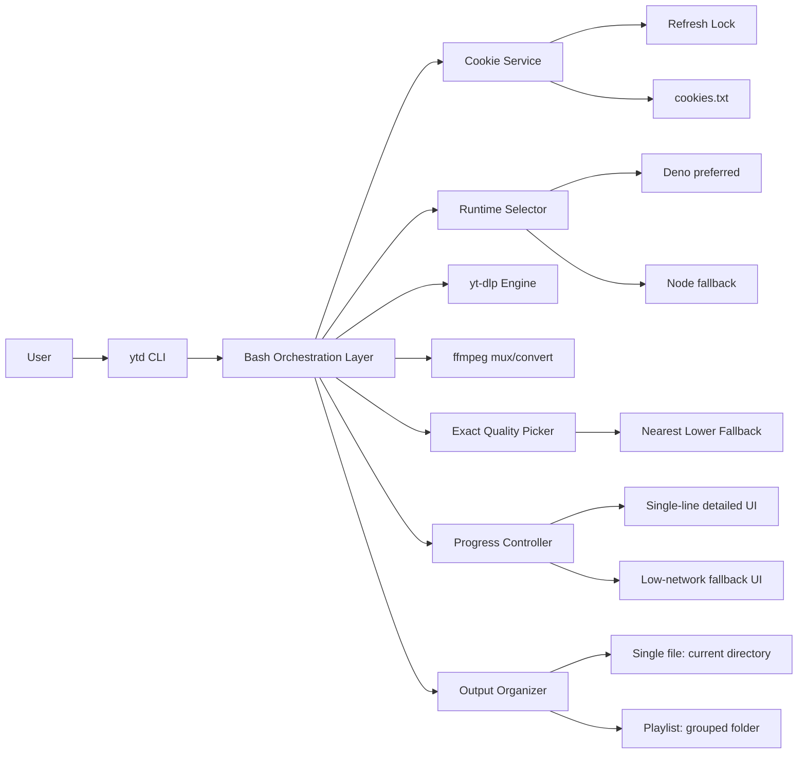

# 🎥 YutubuDownload  
### *Tanzania-Optimized YouTube Downloader for Ubuntu Terminal*  

> “Out here doing some Alien things, Jesus is King...” — Johnbosco (Isaiah 28:21)

<div align="center">

```
█████ █████             █████               █████                ██████████                                       ████                         █████
░░███ ░░███             ░░███               ░░███                ░░███░░░░███                                     ░░███                        ░░███ 
 ░░███ ███   █████ ████ ███████   █████ ████ ░███████  █████ ████ ░███   ░░███  ██████  █████ ███ █████ ████████   ░███   ██████   ██████    ███████ 
  ░░█████   ░░███ ░███ ░░░███░   ░░███ ░███  ░███░░███░░███ ░███  ░███    ░███ ███░░███░░███ ░███░░███ ░░███░░███  ░███  ███░░███ ░░░░░███  ███░░███ 
   ░░███     ░███ ░███   ░███     ░███ ░███  ░███ ░███ ░███ ░███  ░███    ░███░███ ░███ ░███ ░███ ░███  ░███ ░███  ░███ ░███ ░███  ███████ ░███ ░███ 
    ░███     ░███ ░███   ░███ ███ ░███ ░███  ░███ ░███ ░███ ░███  ░███    ███ ░███ ░███ ░░███████████   ░███ ░███  ░███ ░███ ░███ ███░░███ ░███ ░███ 
    █████    ░░████████  ░░█████  ░░████████ ████████  ░░████████ ██████████  ░░██████   ░░████░████    ████ █████ █████░░██████ ░░████████░░████████
   ░░░░░      ░░░░░░░░    ░░░░░    ░░░░░░░░ ░░░░░░░░    ░░░░░░░░ ░░░░░░░░░░    ░░░░░░     ░░░░ ░░░░    ░░░░ ░░░░░ ░░░░░  ░░░░░░   ░░░░░░░░  ░░░░░░░░ 
```

**Author:** Johnbosco | **Last Updated:** April 20, 2026  
**Version:** v2.0.0 — *Multi-Instance Shared-Cookie Edition*  
🌍 *Tested across Dar es Salaam, Mwanza, Arusha & Zanzibar networks*  

[](https://github.com/johnboscocjt/Youtube-Downloader-For-UbuntuTerminal)  
[](https://github.com/johnboscocjt/Youtube-Downloader-For-UbuntuTerminal/releases/tag/v2.0.0)
[](LICENSE)

</div>

> 💡 **Zsh users**: After install, run `source ~/.zshrc` once  
> 🌍 **Tanzania Tip**: Run during off-peak hours (after 10 PM EAT) for faster downloads!

---

## 🆕 What's New in v2.0.0?

### 🧠 **MULTI-INSTANCE ARCHITECTURE (MAJOR RELEASE)**
- **Added**: Safe multi-terminal downloads with per-run `SESSION_ID`
- **Added**: Shared `cookies.txt` store with file-lock refresh model
- **Added**: Session-specific temp/log folders for clean isolation
- **Added**: Unique output roots per session to prevent cross-terminal overwrite
- **Added**: Optional fragment tuning via `YTDL_CONCURRENT_FRAGMENTS`
- **Removed**: Browser process killing flow (`pkill chrome/chromium`)

### 🚀 **BETTER PROGRESS BAR + QUALITY PICKING**
- **Fixed**: Progress output now stays cleaner as a single terminal line
- **Fixed**: User-selected quality now targets exact resolution when available
- **Improved**: Falls back to nearest lower available resolution when exact one is missing
- **Improved**: Better quality consistency for 1080p+ selections

### ✨ **CLEAN PROGRESS BAR DISPLAY**
- **Fixed**: No more messy, overlapping progress bar output
- **Enhanced**: Single-line progress bar with clean updates
- **Added**: File size display in real-time
- **Format**: `Title VideoID ████████████████████░ 100.0% | 2.98MiB | ETA: 00:00 | 1.68MiB/s`
- **Completion**: Clean download confirmation: `✓ Downloaded: Title [2.98MiB]`

### 📊 **Enhanced Visual Feedback**
- **Video ID Display**: Shows first 8 characters next to title
- **Real-time File Size**: See download size as it progresses
- **Color-coded Elements**: Consistent terminal coloring
- **Smooth Updates**: Proper carriage returns for single-line updates
- **Multi-Instance Ready**: Supports concurrent terminal sessions with isolated state.

### 🌐 **Low-Network Progress Mode (Not a Failure)**
- **Default behavior**: On healthy networks, progress shows full detail (`ETA` + speed).
- **Automatic fallback**: On unstable/slow links, script switches to `low-network` progress mode.
- **Meaning**: Download is still working; UI is simplified to reduce noisy ETA/speed fluctuations.

Example when unstable network is detected:

```text
sIaT8Jl2zpI █░░░░░░░░░░░░░░ 0.0% | 4.32MiB | low-network
sIaT8Jl2zpI █████░░░░░░░░░░░ 37.6% | 4.32MiB | low-network
sIaT8Jl2zpI ████████░░░░░░ 63.5% | 4.32MiB | low-network
sIaT8Jl2zpI █████████████░ 96.4% | 4.32MiB | low-network
sIaT8Jl2zpI ██████████████░ 100.0% | 4.32MiB | low-network
```

On better networks, you will see richer output like:

```text
Title ██████████░░░░ 78.4% | 3.55MiB | ETA: 00:01 | 613.74KiB/s
```

### ⚔️ **Why v2.0.0 Is Dangerously Powerful (In a Good Way)**
- **More aggressive reliability stack** than normal wrappers: cookies + JS runtime + retries + resume + exact quality fallback.
- **Safer multi-instance behavior** than typical scripts: shared cookie refresh lock + per-run temp/log isolation.
- **Cleaner operator UX** than raw yt-dlp: guided prompts, folder logic, stable progress UI, meaningful failure hints.
- **Built for hard conditions**: unstable links, power/network interruptions, and anti-bot friction.

### 📈 v2.0.0 vs Typical Downloaders
| Capability | v2.0.0 ytd | Typical script wrapper |
|---|---|---|
| Concurrent terminals | ✅ Safe (lock + session isolation) | ⚠️ Often conflicts |
| Cookie handling | ✅ Shared + controlled refresh | ⚠️ Usually ad-hoc |
| Quality targeting | ✅ Exact + fallback | ⚠️ Often best-effort only |
| Progress trustworthiness | ✅ Detailed + adaptive low-network mode | ⚠️ Noisy/inconsistent |
| Playlist organization | ✅ Grouped and predictable | ⚠️ Easy to mix outputs |

### 🧩 Technology Combination Diagram (v2.0.0)


---

## 🌌 Alien-Tech Terminal Experience

YutubuDownload now features **professional terminal interface** with:
- 🔵 **Clean single-line progress updates** for distraction-free downloading
- 📊 **Real-time file size display** so you know what to expect
- 🟡 **Video ID identification** for easy tracking
- ✨ **Faith-powered closing flourish**

Your terminal doesn’t just download — it **declares Kingdom authority over the digital realm**.

---

## ⚡ One-Command Installation (Recommended)

```bash
# Installs ALL dependencies + script globally (run once)
sudo bash -c "$(curl -sL https://raw.githubusercontent.com/johnboscocjt/Youtube-Downloader-For-UbuntuTerminal/main/install.sh)"
```

---

## 🚀 Quick Start

```bash
# 1. CLOSE ALL CHROME WINDOWS COMPLETELY (required for cookie access)
# 2. Open terminal and run:
cd ~/youtubedownloading
ytd

# 3. Follow prompts:
#    • Paste YouTube URL
#    • Choose: Video or MP3
#    • Select quality (720p recommended for unstable networks)
#    • Confirm folder (recommended for playlists)
```

✅ **Done!** Files saved with resume support & no duplicates.

---

## ✨ Key Features

- **🇹🇿 Tanzania-Optimized**  
  Resume support for unstable 4G networks (Vodacom/Airtel/Tigo)
  
- **📊 Clean Progress Display**  
  Single-line progress bar with file size, ETA, and speed (v1.1.6)
  
- **🛡️ Bot-Bypass Technology**  
  Uses Chrome cookies + user-agent spoofing to avoid "Sign in to confirm you're not a bot" errors
  
- **📁 Smart Organization**  
  Playlists saved as `Title [PLAYLIST_ID]` to prevent mixing same-name playlists (common with Bongo Flava compilations!)
  
- **🎵 Flexible Output**  
  Video (any resolution) or MP3 (320kbps/192kbps/128kbps)
  
- **💾 Data-Saving**  
  Never re-downloads completed videos are tracked 
  
- **⚡ Deno-Powered**  
  Solves YouTube's 2026 JavaScript challenges for full quality access

---

## 🔧 Manual Installation (Alternative)

```bash
# 1. Install dependencies
sudo apt update && sudo apt install -y ffmpeg python3-venv python3-pip
sudo curl -L https://github.com/yt-dlp/yt-dlp/releases/latest/download/yt-dlp -o /usr/local/bin/yt-dlp && sudo chmod a+rx /usr/local/bin/yt-dlp
curl -fsSL https://deno.land/install.sh | sh && echo 'export PATH="$HOME/.deno/bin:$PATH"' >> ~/.bashrc && source ~/.bashrc

# 2. Setup Python venv for cookies
mkdir -p ~/youtubedownloading && cd ~/youtubedownloading
python3 -m venv yt-venv && source yt-venv/bin/activate && pip install secretstorage cryptography && deactivate

# 3. Install script
sudo curl -sL https://raw.githubusercontent.com/johnboscocjt/Youtube-Downloader-For-UbuntuTerminal/main/YutubuDownload -o /usr/local/bin/YutubuDownload && sudo chmod +x /usr/local/bin/YutubuDownload && sudo ln -sf /usr/local/bin/YutubuDownload /usr/local/bin/ytd
```

---

## 🖥️ Platform Support

- **Linux (Ubuntu/Debian and similar)**: Fully supported.
- **Windows**: Use **WSL (Windows Subsystem for Linux)** or a Linux VM. This tool is Unix shell based.
- **macOS**: Supported (Unix-based). Install equivalent dependencies (`ffmpeg`, `python3`, `pip`, `yt-dlp`, `deno`) using Homebrew.

In short: this workflow is **distro-agnostic and Unix-based**.

---

## 📘 How To Use (Follow-Through)

### 1. Download a Single Video
1. Run `ytd`
2. Paste video URL
3. Choose `1` for single video
4. Choose `1` for video or `2` for MP3
5. Select quality (for video)
6. Confirm download

### 2. Download Audio (MP3)
1. Run `ytd`
2. Paste URL (video or playlist)
3. Choose type (single/playlist)
4. Choose `2` for MP3
5. Pick audio quality (320k/192k/128k)
6. Confirm and wait for extraction

### 3. Download a Full Playlist
1. Run `ytd`
2. Paste playlist URL
3. Choose `2` for full playlist
4. Keep dedicated playlist folder enabled (recommended)
5. Confirm and monitor progress

Expected behavior:
- Strong network: full ETA + speed in one single-line progress UI.
- Very weak network: adaptive `low-network` label appears to reduce noisy telemetry.

---

## 📚 Full Documentation

For detailed setup, troubleshooting, and advanced usage:  
👉 **[Complete Documentation](https://github.com/johnboscocjt/Youtube-Downloader-For-UbuntuTerminal/blob/main/YTdownloadScriptForVideoPlaylistAudio.md)**

---

## 🔁 How to Update

```bash
# One command to update to latest version
sudo bash -c "$(curl -sL https://raw.githubusercontent.com/johnboscocjt/Youtube-Downloader-For-UbuntuTerminal/main/install.sh)"
```

## OR Manual Update to v2.0.0:
```bash
# Fetch latest version
sudo curl -sL https://raw.githubusercontent.com/johnboscocjt/Youtube-Downloader-For-UbuntuTerminal/main/YutubuDownload -o /usr/local/bin/YutubuDownload
sudo chmod +x /usr/local/bin/YutubuDownload
sudo ln -sf /usr/local/bin/YutubuDownload /usr/local/bin/ytd

# Check version
ytd --version
# Should show: ytd (YutubuDownload) v2.0.0 (2026-04-20) • Tanzania-Optimized • MULTI-INSTANCE + SHARED COOKIES
```

---

## 📸 Screenshots

<div align="center">
  
### **1. Clean Progress Bar**

*Single-line progress with file size and ETA*

### **2. Terminal Interface & Main Menu**


### **3. URL Input & Processing**


### **4. Format Selection (Video/MP3)**


### **5. Quality Selection & Download Progress**


### **6. Completion & File Organization**


<br />

### **NOTE : Some times it will fail to download because of the 1.Time you are using, 2.WiFi/Network you are using, 3.New BOT block 4.You have to update and upgrade packages to latest releases for better downloading, 4.Update wifi if broken**


### **SOLUTION : Update and upgrade your PC and your wifi package if broken, Use Mobile Data by hotspotting your pc from your phone, Keep trying, close and re-open terminal, Kill chrome sessions or even close browsers, Find Ethernet and use it for downloading**

<br />

### **7. New Version : v2.0.0**


### **8. v2 Real Download Session (Audio Playlist x3)**


</div>

---

## 📋 Changelog

### v2.0.0 (2026-04-20)
- **Added**: Multi-instance safe architecture for parallel terminal usage
- **Added**: Shared cookie service (`cookies.txt`) with refresh locking
- **Added**: Per-session output root, temp dir, and log file isolation
- **Added**: `YTDL_CONCURRENT_FRAGMENTS` environment tuning for strong networks
- **Improved**: Better quality selection reliability for exact resolution picks
- **Improved**: Better single-line progress behavior on unstable links

### v1.1.9 (2026-04-20)
- **Fixed**: Better single-line progress behavior on unstable/slow networks
- **Fixed**: Exact quality selection now respected when available
- **Improved**: Automatic fallback to nearest lower available resolution
- **Improved**: More reliable 1080p+ quality outcomes

### v1.1.6 (2026-02-10)
- **Fixed**: Progress bar display - now shows single clean line
- **Added**: File size display in progress bar
- **Added**: Video ID (short) in progress display
- **Improved**: Terminal output formatting
- **Optimized**: Tanzania network compatibility

### v1.1.5 (2026-02-10)
- **Added**: File size to progress bar output
- **Fixed**: EOF error in folder organization

### v1.1.4 (2026-02-10)
- **Fixed**: Color codes and banner display
- **Added**: Metadata display before download

### v1.1.0 (2026-02-09)
- **Initial**: Tanzania-optimized YouTube downloader

---

## ❓ Why Built for Tanzania?

> *"As a developer in Dar es Salaam, I created YutubuDownload to solve real problems Tanzanian users face daily:*  
> - *Mobile data is expensive → resume support saves money after disconnects*  
> - *Same-name playlists everywhere → ID-based folders prevent chaos*  
> - *YouTube aggressively blocks Tanzanian IPs → cookie + user-agent bypass works*  
> - *Power cuts interrupt downloads → archive tracking prevents duplicates*  
> *Tested on Vodacom 4G in Kariakoo, Airtel in Mwanza, and slow hotel Wi-Fi in Zanzibar."*  
> **— Johnbosco, Creator (February 2026)**

---

## 🚀 Future Roadmap
- [x] Parallel download support
- [ ] Download queue management  
- [ ] GUI wrapper option
- [ ] Mobile app companion

---

## 🤝 Support & Contribution

🐞 **Found a bug?** → [Open GitHub Issue](https://github.com/johnboscocjt/Youtube-Downloader-For-UbuntuTerminal/issues)  
💡 **Have an idea?** → Pull requests welcome!  
💬 **Tanzanian user community**: Join discussions on GitHub  

<div align="center">
  
⭐ **If this saves you time/data in Tanzania, please star the repo!**  
[](https://github.com/johnboscocjt/Youtube-Downloader-For-UbuntuTerminal)  

**"YutubuDownload v2.0.0: Multi-instance downloads with shared cookies for Tanzania"**  
— Johnbosco, Dar es Salaam 🇹🇿  

</div>
