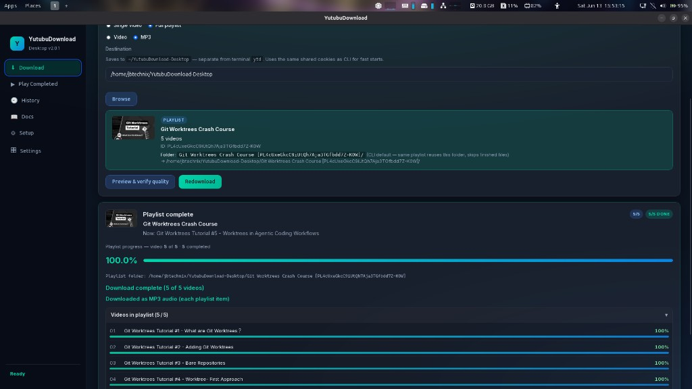
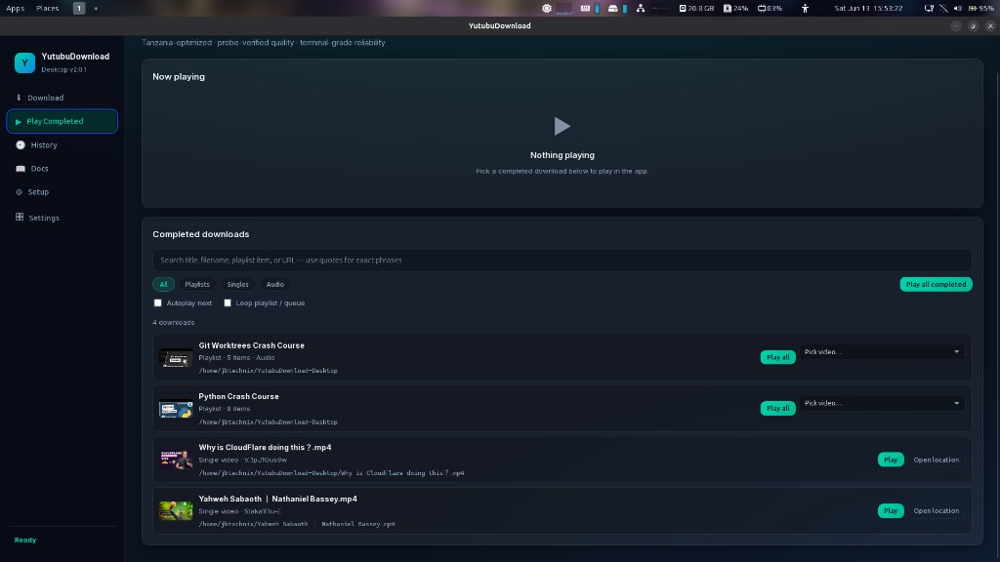
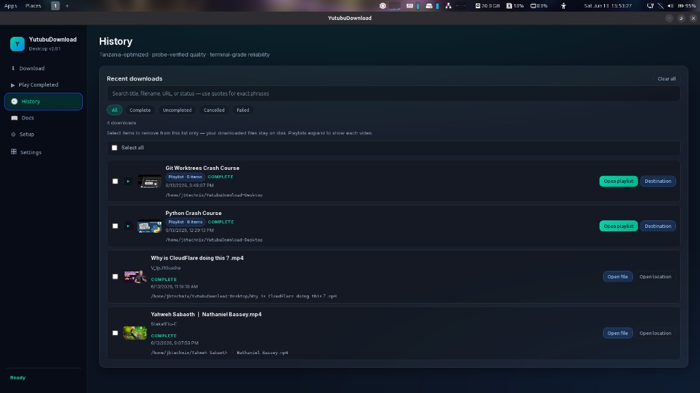
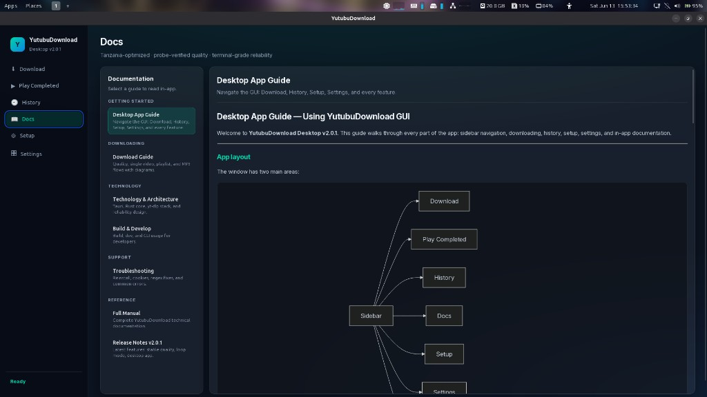
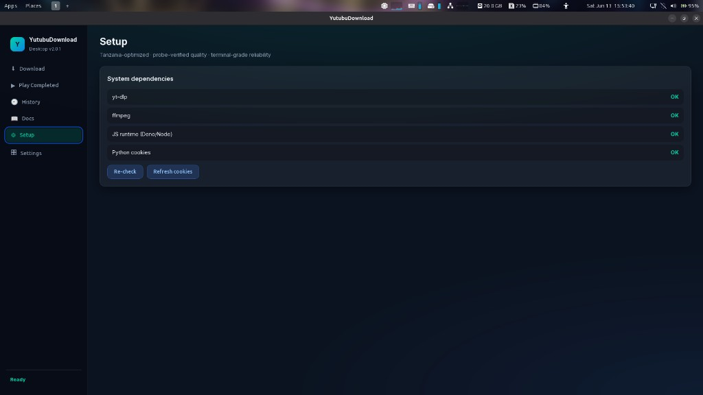
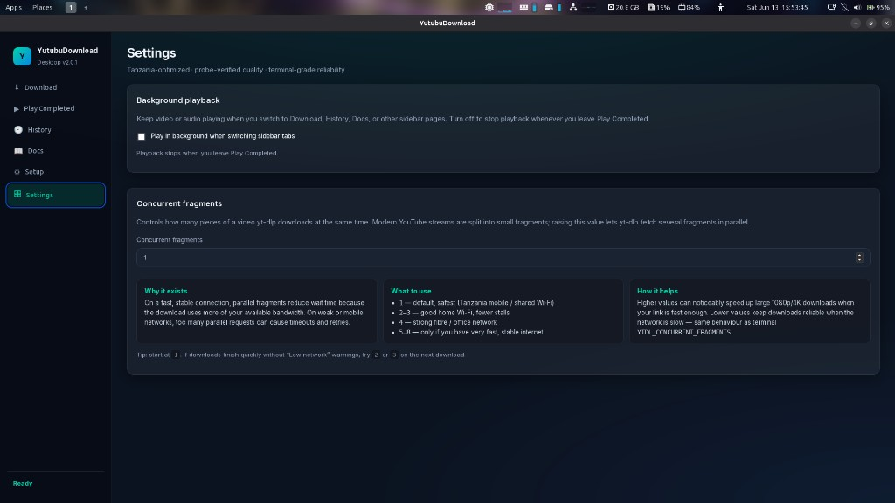

# YutubuDownload Desktop

### *Tanzania-optimized YouTube downloader — desktop app + terminal*

YutubuDownload Desktop is the Tauri GUI for this repository. Download and play videos, playlists, and MP3 files with probe-verified quality, shared cookies, and the same Rust core as the terminal `ytd` tool.

**Version:** 2.0.1 · **Linux:** `.deb` installer · **Windows / macOS:** coming soon

## What This Repo Is

| Path | Purpose |
|------|---------|
| `desktop/` | Tauri + React desktop app |
| `crates/ytd-core/` | Shared Rust download engine |
| `website/` | Next.js landing page and download site |
| `Screenshots/desktop/` | Current UI screenshots for docs |

## Deploy the website (Vercel)

The public site is **`website/`** (Next.js), **not** the repo root.

| Wrong | Right |
|-------|-------|
| Root Directory = `.` (wrong — nothing useful deploys) | Root Directory = **`website`** |

If https://ytddesktop.vercel.app does not show the new landing page, set Root Directory to `website` in Vercel — see **[VERCEL.md](VERCEL.md)**.

```bash
cd website && npm install && npm run dev   # http://localhost:3000
```

After building a `.deb`, copy it for the site download button:

```bash
cp target/release/bundle/deb/YutubuDownload_*.deb website/public/downloads/
```


```bash
cd desktop
npm install
npm run tauri dev
```

## Build Linux `.deb`

```bash
cd desktop
npm install
npm run tauri build
```

The `.deb` package appears under `target/release/bundle/deb/` (repo root Cargo workspace).

Install on Ubuntu/Debian:

```bash
sudo dpkg -i YutubuDownload_*_amd64.deb
sudo apt-get install -f   # if dependencies are missing
```

## Requirements

- Rust 1.88.0
- Node.js 20+
- `yt-dlp`, `ffmpeg`, Deno or Node, Python with `browser-cookie3`
- Linux desktop deps — see [desktop/README.md](desktop/README.md)

## App tour (screenshots)

Each sidebar page is documented below. Full walkthrough: [desktop/docs/GUI_APP_GUIDE.md](desktop/docs/GUI_APP_GUIDE.md).

### 1. Download — playlist as MP3



Paste a URL, choose **Full playlist** and **MP3**, set a destination, then start. When complete you see per-video progress, the real playlist title, and confirmation that each item was saved as audio.

### 2. Play Completed — library and playback



Browse finished downloads, filter by playlists/singles/audio, search by title, and use **Play all** or **Pick video…** for playlists. Autoplay and loop options control the queue.

### 3. History — track and open files



Every job is listed with status and path. **Open playlist** launches VLC/mpv with an M3U; **Destination** opens the save folder. Single files have **Open file** and **Open location**.

### 4. Docs — help inside the app



Guides for setup, downloading, technology, troubleshooting, and release notes — no browser required.

### 5. Setup — dependency check



Confirms `yt-dlp`, `ffmpeg`, JS runtime, and Python cookies. Use **Re-check** after installing tools and **Refresh cookies** for sign-in errors.

### 6. Settings — network and playback



**Background playback** keeps audio/video running when you switch tabs. **Concurrent fragments** tunes parallel downloads for your network (start at `1` on mobile Wi‑Fi).

## Features

- Single videos, full playlists, and MP3 extraction
- Probe-verified video quality before download
- Real playlist folder names (not placeholder IDs)
- In-app playback with mpv; HTML player fallback
- **Open playlist** in VLC/mpv from History
- Pause/resume downloads on Linux
- Concurrent-fragment tuning for Tanzania/mobile networks
- Built-in documentation

## Documentation

- [Desktop app guide](desktop/docs/GUI_APP_GUIDE.md)
- [Desktop README / build](desktop/README.md)
- [Technology notes](desktop/docs/TECHNOLOGY.md)
- [Release notes v2.0.1](desktop/docs/RELEASE_v2.0.1.md)
- [Download guide](DOWNLOAD_GUIDE.md)
- [Troubleshooting](TROUBLESHOOTING.md)

## Terminal install (Linux)

The classic `ytd` command is still available from the terminal repo:

```bash
sudo bash -c "$(curl -sL https://raw.githubusercontent.com/johnboscocjt/Youtube-Downloader-For-UbuntuTerminal/main/install.sh)"
```

## Repository

- **Desktop app:** https://github.com/johnboscocjt/YutubuDownload-Desktop
- **Terminal `ytd`:** https://github.com/johnboscocjt/Youtube-Downloader-For-UbuntuTerminal

## License

MIT · Johnbosco
