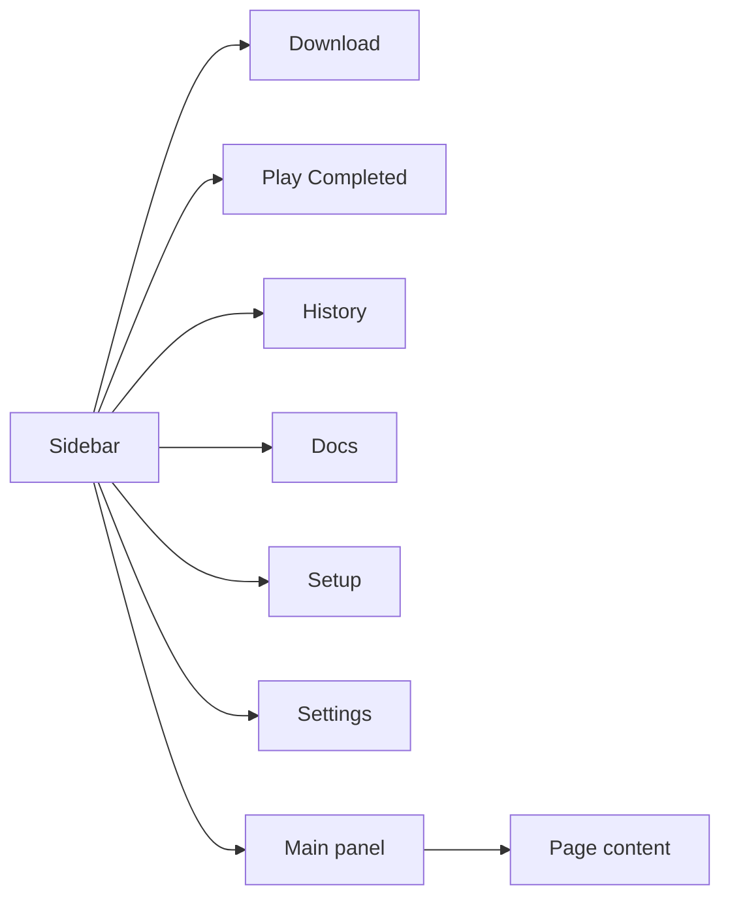

# Desktop App Guide — Using YutubuDownload GUI

Welcome to **YutubuDownload Desktop v2.0.1**. This guide walks through every part of the app with screenshots: sidebar navigation, downloading, playback, history, setup, settings, and in-app documentation.

---

## App layout

The window has two main areas:

| Area | Purpose |
|------|---------|
| **Sidebar** | Switch between Download, Play Completed, History, Docs, Setup, Settings |
| **Main panel** | Shows the active page (forms, progress, documentation) |
| **Status (bottom-left)** | **Ready** when dependencies are installed, **Setup required** when something is missing |

---

## Download

The **Download** page is where you paste URLs, choose format, and track progress.

**What you see in this screenshot**

- **Full playlist** mode selected — all items in the playlist are downloaded into one numbered folder.
- **MP3** format selected — each item is extracted as audio (not video).
- **Destination** shows where files are saved (`~/YutubuDownload-Desktop` by default). Use **Browse** to change it.
- The playlist card shows the real title (**Git Worktrees Crash Course**), thumbnail, item count, and folder path.
- **Preview & verify quality** checks metadata before you start; **Redownload** lets you run the job again.
- When finished, the progress card shows **Playlist complete · 5/5 DONE**, per-video progress, and a confirmation that files were saved as MP3.

### Step-by-step

1. **Paste a YouTube URL** (video or playlist).
2. **Choose type** — **Single video** or **Full playlist**.
3. **Choose format** — **Video** (pick max height) or **MP3** (audio only).
4. **Destination** — folder for saved files. Click **Browse** to pick a folder.
5. **Preview & verify quality** (recommended for video) — fetches title, thumbnail, heights, and confirms resolution.
6. **Start download** — progress appears below the form.

### During a download

- **Thumbnail** and title (playlist folders use the real playlist name, not a placeholder ID).
- **Percent bar**, speed, ETA (hidden on weak networks).
- **Low network** badge when the connection is unstable — download continues.
- **Pause / Resume** (Linux) — temporarily suspend yt-dlp.
- **Cancel** — stops the download.
- **Open destination** — opens the save folder in your file manager.

---

## Play Completed

**Play Completed** lets you watch or listen to finished downloads inside the app (mpv when available).

**What you see in this screenshot**

- **Now playing** at the top — empty until you pick a file; then shows the current track and controls.
- **Search** — find downloads by title, filename, playlist item, or URL (use quotes for exact phrases).
- **Filters** — **All**, **Playlists**, **Singles**, **Audio** narrow the list.
- **Autoplay next** and **Loop playlist / queue** control queue behaviour.
- **Play all completed** starts every finished download in order.
- Each row shows type badges (e.g. **Playlist · 5 items · Audio**), save path, **Play all**, and **Pick video…** for playlists.
- Single videos have **Play** and **Open location**.

### Playlist playback

- **Play all** runs the full queue; numbered picks start from that track.
- **Now playing** shows current title and track number.
- **Up next** lists remaining items — click any to jump.
- **Previous / Next** move through the queue.
- MP3 playlists use the audio player; video files use the video player (extension wins).

---

## History

**History** lists recent downloads (completed, cancelled, or failed).

**What you see in this screenshot**

- **Search** by title, filename, URL, or status.
- **Filters** — **All**, **Complete**, **Uncompleted**, **Cancelled**, **Failed**.
- Playlist rows show item count, status, timestamp, and save path.
- **Open playlist** — builds an M3U and opens it in VLC or mpv (external player).
- **Destination** — opens the folder where that job saved files.
- **Open file** / **Open location** for single-video downloads.
- **Clear all** removes history only — **files on disk are not deleted**.

---

## Docs

Built-in guides open here without leaving the app.

**What you see in this screenshot**

- Left column lists guides by category: **Getting Started**, **Downloading**, **Technology**, **Support**, **Reference**.
- **Desktop App Guide** (this page) is selected; content renders on the right with diagrams and formatted text.
- Other guides: **Download Guide**, **Technology & Architecture**, **Player & Download Performance**, **Troubleshooting**, **Build & Develop**, **Full Manual**, **Release Notes v2.0.1**.

---

## Setup

**Setup** checks tools the app needs (same stack as terminal `ytd`).

**What you see in this screenshot**

- **yt-dlp** — fetching and downloading (**OK**).
- **ffmpeg** — merging video+audio, MP3 conversion (**OK**).
- **JS runtime (Deno/Node)** — YouTube JS challenge solving (**OK**).
- **Python cookies** — browser cookie export for age-restricted videos (**OK**).
- **Re-check** runs a fresh dependency scan.
- **Refresh cookies** updates cookies from your default browser if downloads fail with sign-in or bot errors.

If any row is missing, install hints appear. The sidebar shows **Setup required** until everything is OK.

---

## Settings

**What you see in this screenshot**

- **Background playback** — when checked, video or audio keeps playing when you switch to Download, History, Docs, or other tabs. When off, playback stops when you leave **Play Completed**.
- **Concurrent fragments** — how many stream fragments yt-dlp fetches in parallel (same idea as terminal `YTDL_CONCURRENT_FRAGMENTS`).

| Value | When to use |
|-------|-------------|
| **1** | Default — safest on mobile / shared Wi‑Fi (Tanzania networks) |
| **2–3** | Good home Wi‑Fi |
| **4** | Strong fibre or office network |
| **5–8** | Only on very fast, stable internet |

Start at **1**, then try **2** or **3** if downloads finish without **Low network** warnings.

---

## Terminal vs desktop

| Feature | Desktop app | Terminal `ytd` |
|---------|-------------|----------------|
| Graphical UI | ✓ | — |
| Quality preview + thumbnail | ✓ | Prompts |
| Pause download | Linux | — |
| Download history + Open playlist | ✓ | — |
| In-app playback | ✓ | — |
| Loop mode (multiple URLs) | — | ✓ |
| Same quality probing | ✓ | ✓ |
| Same cookie / yt-dlp core | ✓ | ✓ |

You can use both on the same machine; they share the same download engine (`ytd-core`).

---

## Quick troubleshooting

| Problem | Try |
|---------|-----|
| Setup required | Open **Setup**, install missing tools, **Re-check** |
| Sign-in / bot error | **Setup** → **Refresh cookies** |
| Wrong quality | **Preview & verify quality** before starting |
| Slow or stalling | **Settings** → set concurrent fragments to **1** |
| Playlist shows wrong name | Re-download or check folder under Destination |
| Cancel ignored | Wait a moment; cancel kills the yt-dlp process |

See **Troubleshooting** in Docs for more detail.

---

**Version:** 2.0.1 · **Author:** Johnbosco · Tanzania-optimized · probe-verified quality
