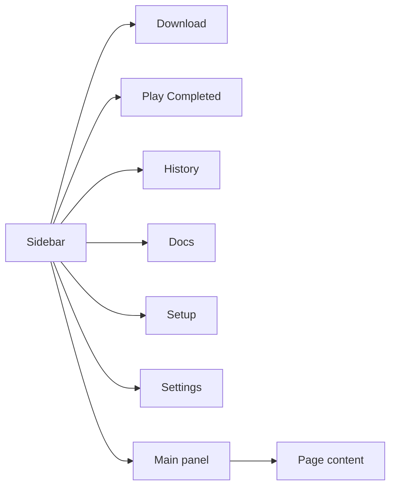

# Desktop App Guide — Using YutubuDownload GUI

Welcome to **YutubuDownload Desktop v2.0.1**. This guide walks through every part of the app: sidebar navigation, downloading, history, setup, settings, and in-app documentation.

---

## App layout

The window has two main areas:

| Area | Purpose |
|------|---------|
| **Sidebar** | Switch between Download, Play Completed, History, Docs, Setup, Settings |
| **Main panel** | Shows the active page (forms, progress, documentation) |
| **Status (bottom-left)** | **Ready** when dependencies are installed, **Setup required** when something is missing |

---

## Download

The **Download** page is where you paste URLs and start jobs.

### Step-by-step

1. **Paste a YouTube URL** in the URL field (video or playlist link).
2. **Choose type**
   - **Single video** — one file
   - **Full playlist** — all items; saved in a numbered playlist folder
3. **Choose format**
   - **Video** — pick max height (360p–4K)
   - **MP3** — audio only
4. **Destination** — folder where files are saved. Click **Browse** to pick a folder (defaults to your home directory).
5. **Preview & verify quality** (recommended for video) — fetches title, thumbnail, available heights, and confirms your resolution before download.
6. **Start download** — begins the job; progress appears below the form.

### During a download

The progress card shows:

- **Thumbnail** and title
- **Percent bar**, speed, ETA (hidden on weak networks)
- **Low network** badge when the connection is unstable — download continues
- **Pause / Resume** (Linux) — temporarily suspend the yt-dlp process
- **Cancel** — stops the download
- **Open destination** — opens the save folder in your file manager
- **Show technical log** — optional raw yt-dlp output (hidden by default)

### Tips

- Run **Preview** first on slow networks so quality is confirmed before a long download.
- For playlists, use **Full playlist** and a dedicated **Destination** with enough free space.
- If **Setup required** appears at the bottom of the sidebar, open **Setup** before downloading.

---

## History

**History** lists recent downloads (completed, cancelled, or failed).

| Action | What it does |
|--------|----------------|
| **Playlist row** | One entry per playlist; click **▸** or the row to expand and see each video |
| **Single video** | One flat row with thumbnail, title, status, date |
| **Destination** | Opens the folder where that job saved files |
| **Clear history** | Removes the list only — **files on disk are not deleted** |

Empty state: **No recent downloads** until you finish at least one job.

---

## Play Completed

**Play Completed** lets you watch or listen to finished downloads inside the app (no external player required).

| Type | What you see |
|------|----------------|
| **Single video / audio** | One player — **Play** starts that file |
| **Playlist** | **Play all** runs the full queue; numbered buttons (**01**, **02**, …) start from that track |

While a playlist is playing:

- **Now playing** shows the current title and track number
- **Up next** lists the remaining items — click any to jump ahead
- **Previous / Next** move through the queue
- When **Play all** is active, the next track starts automatically when one finishes

Files are loaded from your **Destination** folder. Older history entries without saved paths are matched automatically by title and playlist index.

---

## Setup

**Setup** checks tools the app needs (same as terminal `ytd`):

| Tool | Required for |
|------|----------------|
| **yt-dlp** | Fetching and downloading |
| **ffmpeg** | Merging video+audio, MP3 conversion |
| **Deno or Node** | YouTube JS challenge solving |
| **Python + browser-cookie3** | Cookie export for age-restricted videos |

Use **Refresh status** after installing tools. Use **Refresh cookies** if downloads fail with sign-in or bot errors (uses your default browser cookies).

Install hints are shown per tool when something is missing.

---

## Settings

### Concurrent fragments

Controls how many **fragments** yt-dlp downloads in parallel (same as terminal `YTDL_CONCURRENT_FRAGMENTS`).

| Value | When to use |
|-------|-------------|
| **1** | Default — safest on mobile / shared Wi‑Fi (Tanzania networks) |
| **2–3** | Good home Wi‑Fi |
| **4** | Strong fibre or office network |
| **5–8** | Only on very fast, stable internet |

Higher values can speed up large 1080p/4K files on fast links. Too many on weak links may cause timeouts. Start at **1**, then try **2** or **3** if downloads finish without **Low network** warnings.

---

## Docs (this section)

Built-in guides open here without leaving the app:

| Guide | Contents |
|-------|----------|
| **Desktop App Guide** | This page — GUI navigation and features |
| **Download Guide** | Quality probing, video, playlist, MP3 flows (with diagrams) |
| **Technology** | Rust core, Tauri, yt-dlp stack |
| **Troubleshooting** | Common fixes |
| **Release Notes** | What changed in v2.0.1 |

Select a title on the left; content renders on the right with diagrams and formatted text.

---

## Terminal vs desktop

| Feature | Desktop app | Terminal `ytd` |
|---------|-------------|----------------|
| Graphical UI | ✓ | — |
| Quality preview + thumbnail | ✓ | Prompts |
| Pause download | Linux | — |
| Download history | ✓ | — |
| Loop mode (multiple URLs) | — | ✓ |
| Same quality probing | ✓ | ✓ |
| Same cookie / yt-dlp core | ✓ | ✓ |

You can use both on the same machine; they share the same download engine (`ytd-core`).

---

## Quick troubleshooting

| Problem | Try |
|---------|-----|
| Setup required | Open **Setup**, install missing tools, **Refresh status** |
| Sign-in / bot error | **Setup** → **Refresh cookies** |
| Wrong quality | **Preview & verify quality** before starting |
| Slow or stalling | **Settings** → set concurrent fragments to **1** |
| Cancel ignored | Wait a moment; cancel kills the yt-dlp process |

See **Troubleshooting** in Docs for more detail.

---

**Version:** 2.0.1 · **Author:** Johnbosco · Tanzania-optimized · probe-verified quality
