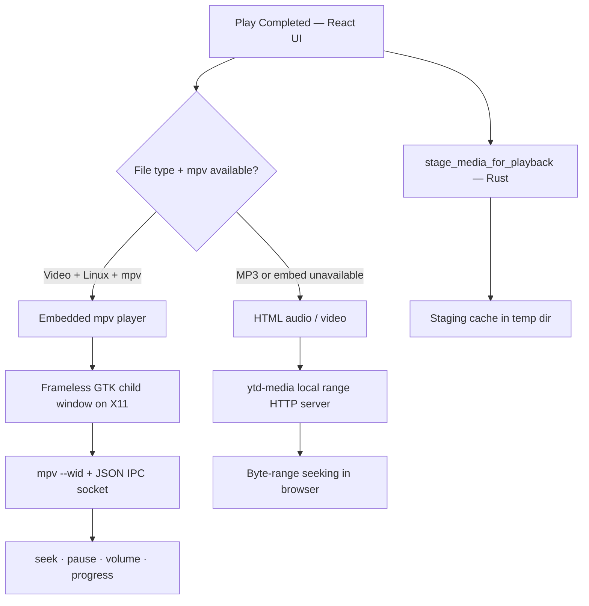
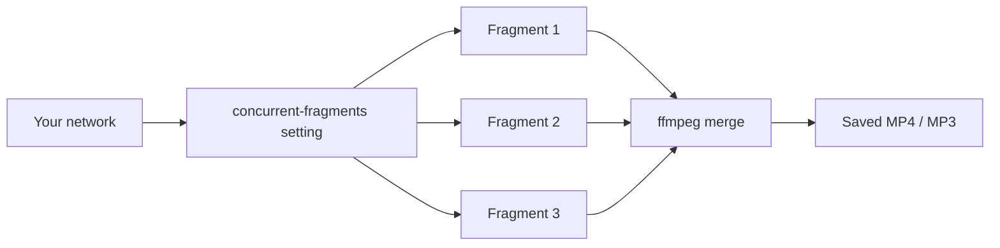
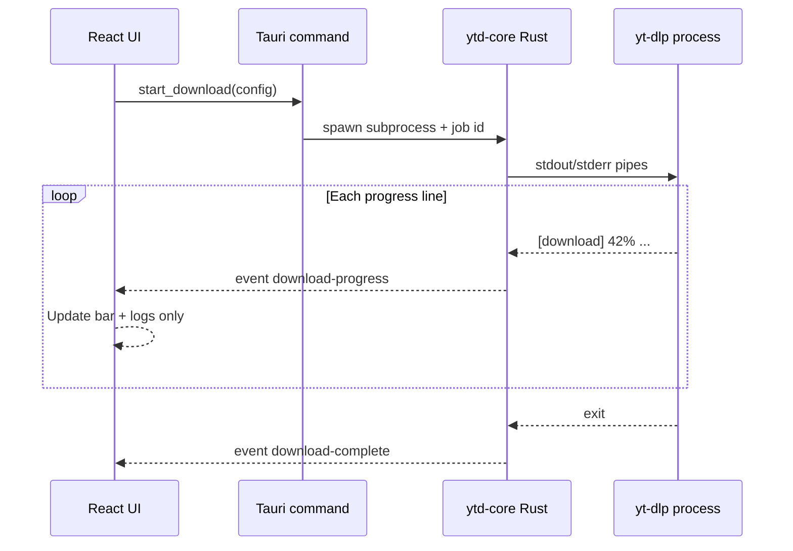

# Player & Download Performance

This guide explains **how the in-app player was built** and **how YutubuDownload stays fast** while downloading — both throughput on the network and responsiveness in the UI.

---

## In-app player — how it was made

**Play Completed** plays finished downloads inside the desktop app. You can watch video, listen to MP3 playlists, scrub the timeline, queue tracks, and (optionally) keep playback running when you switch to other tabs.

### Architecture overview

### Two playback engines

| Mode | When used | How it works |
|------|-----------|--------------|
| **Embedded mpv** | Linux, mpv installed, video files | Native player drawn inside the app window |
| **HTML player** | MP3 audio, or when embed is unavailable | `<audio>` / `<video>` with staged file URLs |

On startup the app calls `has_native_player` (checks for `mpv` on PATH). If mpv is missing, **Setup** shows an install hint and video falls back to the HTML path or **Open in system player**.

### Embedded mpv (Linux) — step by step

1. **Measure the panel** — React reads the video area’s position and size (`getBoundingClientRect`) and sends `NativePlayerBounds` to Rust.
2. **Create a video surface** — On the GTK main thread, Tauri creates a small, undecorated child window positioned exactly over the “Now playing” video box in the webview.
3. **Attach mpv** — mpv is spawned with:
   - `--wid=<X11 window id>` so video renders into that GTK surface
   - `--input-ipc-server=<unix socket>` for remote control
   - `--hwdec=auto-safe` for GPU decode when available
   - `--vo=x11` for reliable embedding on Linux
4. **Control via IPC** — Load file, play/pause, seek, volume, and read `time-pos` / `duration` over JSON messages on the socket.
5. **Fit the frame** — `fitWindow` and `fillFrame` (panscan) keep video filling the panel without letterboxing surprises when you resize the window.
6. **Queue changes** — Switching tracks calls `native_player_load` on the same mpv instance instead of restarting the whole embed when possible.

The launcher script sets `GDK_BACKEND=x11` because embedding requires X11 window IDs; Wayland-only sessions may need the HTML or external player fallback.

### HTML fallback & staging

Not every file can go straight into a webview:

| Step | Purpose |
|------|---------|
| **Resolve files** | Map history entries to real paths on disk (playlists → numbered files in folder) |
| **Stage for playback** | Copy MP3s to a temp cache; probe video codec with ffprobe |
| **Remux or transcode** | Browser-friendly H.264/AAC MP4 when needed (fast remux when already compatible) |
| **Serve with ranges** | Custom `ytd-media://` HTTP handler supports `Range:` headers so seeking works in `<video>` |

Heavy work runs on `spawn_blocking` so the UI thread never freezes while ffmpeg prepares a file.

### Progress bar & scrubbing

The **PlayerProgressBar** component behaves like a desktop media player:

- Click or drag on the bar to scrub
- Pointer capture for smooth dragging
- Live time / remaining display

| Engine | Seek implementation |
|--------|---------------------|
| **mpv embed** | `native_player_seek` → mpv IPC `seek <seconds> absolute` |
| **HTML** | Sets `currentTime` on the media element |

Progress polling reads mpv IPC or `timeupdate` events on HTML media.

### Playlist queue

- **Play all** / per-track picks build an ordered queue from disk
- **Autoplay next** and **Loop playlist** control what happens after each file
- **Up next** list lets you jump to any remaining track
- Extension wins: `.mp3` → audio player; video extensions → video player

### Background playback (Settings)

When **Background playback** is enabled, leaving **Play Completed** does not stop mpv — audio/video continues while you browse Download, History, or Docs. When disabled, playback stops on tab change to save resources.

---

## Fast downloads & a responsive app

“Fast” here means two things: **getting bytes from YouTube quickly** and **keeping the app smooth** while yt-dlp runs.

### Download throughput — parallel fragments

Modern YouTube streams are split into many small fragments. yt-dlp can fetch several at once:

| Setting | Best for |
|---------|----------|
| **1** (default) | Mobile / shared Wi‑Fi — fewest stalls (Tanzania-tuned default) |
| **2–3** | Home Wi‑Fi |
| **4** | Strong fibre or office network |
| **5–8** | Very fast, stable internet only |

Configured in **Settings → Concurrent fragments**. Passed to yt-dlp as `--concurrent-fragments N` from the shared Rust `ytd-core` crate (same logic as terminal `ytd`).

### Other speed & reliability flags

| Feature | What it does |
|---------|----------------|
| **Resume** (`--continue`) | Pick up partial files after cancel or crash |
| **Skip completed** (`--no-overwrites`) | Playlist jobs skip already-downloaded items |
| **Retries** | `--retries 3`, `--fragment-retries 3`, `--file-access-retries 3` |
| **Exact format chain** | Verified height from probe — less wasted re-downloads |
| **Cookie + Deno/Node** | Fewer bot-check failures that slow or block jobs |

### Why the UI stays fast during downloads

The GUI never shells out to yt-dlp on the main thread. Everything is asynchronous:

| Layer | Responsibility |
|-------|----------------|
| **React** | Renders form, progress bar, logs; listens to events |
| **Tauri commands** | `start_download`, `pause_download`, `cancel_download` — return immediately with job id |
| **ytd-core** | Owns child process; `tokio` task parses stdout line-by-line |
| **Events** | `download-progress` / `download-complete` push updates without blocking |

**Pause / cancel** send Unix signals to the yt-dlp process group (`setpgid` on spawn) so the UI does not wait for the process to exit before accepting the next click.

### Quality preview without blocking the window

**Preview & verify quality** runs before you commit to a long download:

1. Metadata fetch and height listing run on a **blocking thread pool** (`spawn_blocking`), not the webview thread.
2. `resolve_video_quality` uses `yt-dlp --simulate` to confirm the real format.
3. The verified `format_string` is stored on the job config — download starts with the correct format, not a second guess.

So the window stays interactive while probes run; only the preview card updates when results arrive.

### Low-network mode

When speed telemetry from yt-dlp is unstable (common on weak links), the app:

- Shows a **Low network** badge
- Hides noisy ETA values that would jump constantly
- **Keeps downloading** — no automatic cancel

Pair this with **concurrent fragments = 1** on difficult networks to reduce timeouts and retries.

### Docs page speed (offline guides)

In-app documentation is designed to work **after `.deb` install without internet**:

- Markdown bodies are **embedded in the binary** (`include_str!` in Rust) for core guides
- Screenshots are **bundled via Vite imports** (hashed assets in the release build)
- Mermaid diagrams render **client-side** in the webview with a dark theme matched to the app

That is why Docs opens instantly and works on a plane — nothing is fetched from GitHub at runtime.

---

## Quick reference

| Topic | Where in the app |
|-------|------------------|
| Play finished files | **Play Completed** |
| Scrub / seek | Progress bar under Now playing |
| Parallel download speed | **Settings → Concurrent fragments** |
| Dependencies (mpv, yt-dlp) | **Setup** |
| Download flow diagrams | **Docs → Download Guide** |
| Stack overview | **Docs → Technology & Architecture** |
